<p align="center"></p>
<p align="center"></p>


[]()
[](https://github.com/safehopper/SafeHopper/graphs/contributors)
[](https://GitHub.com/Naereen/StrapDown.js/graphs/commit-activity)


***
## Basic Overview
SafeHopper is a security app that monitors athletes while they run, bike, or hike on their favorite route. SafeHopper helps outdoor athletes by providing an extra layer of security while they focus on their workout.
***
## Table of Contents
- [Features And Functionalities](#features-and-functionalities)
  - [A specific profile for each user](#a-specific-profile-for-each-user)
  - [User information saved securely on DynamoDB database](#user-information-saved-securely-on-dynamodb-database)
  - [Connecting to Google LocationServices API](#connecting-to-google-locationservices-api)
  - [Getting the current location](#getting-the-current-location)
  - [Tracking user on a route](#tracking-user-on-a-route)
  - [Setting the desired route](#setting-the-desired-route)
  - [Adding emergency contacts](#adding-emergency-contacts)
  - [Generate webpage on alert trigger](#generate-webpage-on-alert-trigger)
  - [Sending emergency alerts to saved contacts via Email or Phone Number](#sending-emergency-alerts-to-saved-contacts-via-email-or-phone-number)


- [Code Snippets](#code-snippents)
  
- [User Manual](#user-manual)
  - [1.0 Getting Started](#getting-started)
    - [1.1 Creating Account](#11-creating-account)
    - [1.2 Logging In](#12-logging-in)
  - [2.0 Contacts](#contacts)
    - [2.1 Add Contact](#21-add-contact)
    - [2.2 View Contact](#22-view-contact)
    - [2.3 Edit Contact](#23-edit-contact)
    - [2.4 Delete Contact](#24-delete-contact)
  - [3.0 Routes](#routes)
    - [3.1 Create Route](#31-create-route)
    - [3.2 View Route](#32-view-route)
    - [3.3 Delete Route](#33-delete-route)
  - [4.0 Session](#session)
    - [4.1 How to start a Session](#41-how-to-start-a-session)
    - [4.2 Session Without Route](#42-session-without-route)
    - [4.3 Session With Route](#43-session-with-route)
  - [5.0 Settings](#settings)
    - [5.1 Route Buffer Zone](#51-route-buffer-zone)
    - [5.2 Units](#52-units)
- [Built with](#built-with)
- [API](#api)
  - API Documentation
  - Obtaining an API key
  - Adding the API key to the server application
  - Building an API package
  - Response Codes
- [Development and contribution](#development-and-contributions)


  
## Features And Functionalities


  

| 	|  Main Features 	|
|----	|----------------------------------------------------------------------------	|
| 🔍 	| Supports Android devices 	|
| 🔒 	| Saving user, emergency contact and location data information on a secured database 	|
| 🛰 	| GPS location tracking using google map's API	|
| 🙅‍♀️   	|Using MVVM architecture, all user inputs are saved on the app 	|
| 🔒 	| both automatic and manual user's permission for location tracking	| 
| 🌏 	| Customizable routes to be tracked on  	|
| ⏱ 	| Support continous location monitoring with fixed minumum time interval	|

## Functionalities

### A specific profile for each user
### User information saved securely on DynamoDB database 
### Connecting to Google LocationServices API
### Getting the current location
### Tracking user on a route
### Setting the desired route
### Adding emergency contacts
### Generate webpage on alert trigger 
### Sending emergency alerts to saved contacts via Email or Phone Number

## Code Snippents
### Get an API key and enable the necessary APIs
To get an API key:

  - Visit the Google Cloud Platform Console.
- Click the project drop-down and select or create the project for which you want to add an API key.
- Click the menu button  and select APIs & Services > Credentials.
- On the Credentials page, click Create credentials > API key. 
- The API key created dialog displays your newly created API key.
Click Close. 
- The new API key is listed on the Credentials page under API keys. (Remember to restrict the API key before using it in production.)

Add the API key to your app:

Follow the steps below to include the API key in your application's manifest, contained in the file ```AndroidManifest.xml```.

In ``` AndroidManifest.xml```, add the following element as a child of the <application> element, by inserting it just before the closing </application> tag:
``` java
    <meta-data
        android:name="com.google.android.geo.API_KEY"
        android:value="YOUR_API_KEY"/>
```

In the value attribute, replace YOUR_API_KEY with your API key (the encrypted string). This element sets the key com.google.android.geo.API_KEY to the value of your API key.
Save AndroidManifest.xml and re-build your application.


### Retrieving User Location
Enable the my location layer if the permission has been granted.
This method enables the location layer if the permission has been granted. 

```Java
private void enableMyLocation() {
        if (ContextCompat.checkSelfPermission(this, Manifest.permission.ACCESS_FINE_LOCATION)
                != PackageManager.PERMISSION_GRANTED) {
            PermissionUtils.requestPermission(this, LOCATION_PERMISSION_REQUEST_CODE,
                    Manifest.permission.ACCESS_FINE_LOCATION, true);
        }
        else if(mMap != null){
            mMap.setMyLocationEnabled(true);
        }
    }
```
If permission to user location has been granted , user location is retrieved and a blue circle is displayed on the google map. This method will retrieve the current location and log the lat/lng.
```Java
 private void getCurrentLocation(){
        fusedLocationClient = LocationServices.getFusedLocationProviderClient(this);
        fusedLocationClient.getLastLocation()
                .addOnSuccessListener(this, new OnSuccessListener<Location>() {
                    @Override
                    public void onSuccess(Location location) {
                        // Got last known location. In some rare situations this can be null.
                        Log.d("CURRENT-LOCATION", location.toString());
                    }
                });
    }
```


## User Manual
## Getting Started
***
### 1.1 Creating Account
To use the SafeHopper app, you have to first create a SafeHopper account.
1. Open the SafeHopper app 
2. If you don't have a SafeHopper account, this is the time to create one
3. Click on the top left corner to open the menu options.  <p align="center">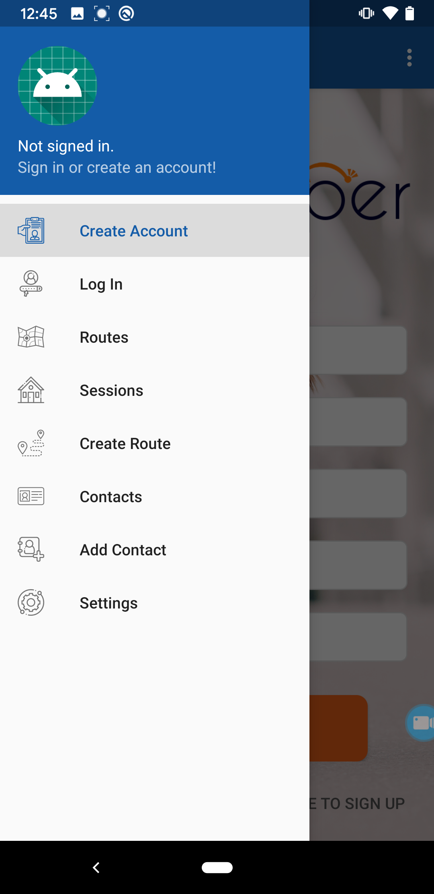</p>
4. Click on the "Create Account".

5. You are now redirected to a new page where you would enter your information in the required fields. This information consist of a "Email Address", "Password", "First Name", "Last Name", and a "Phone Number".
   <p align="center">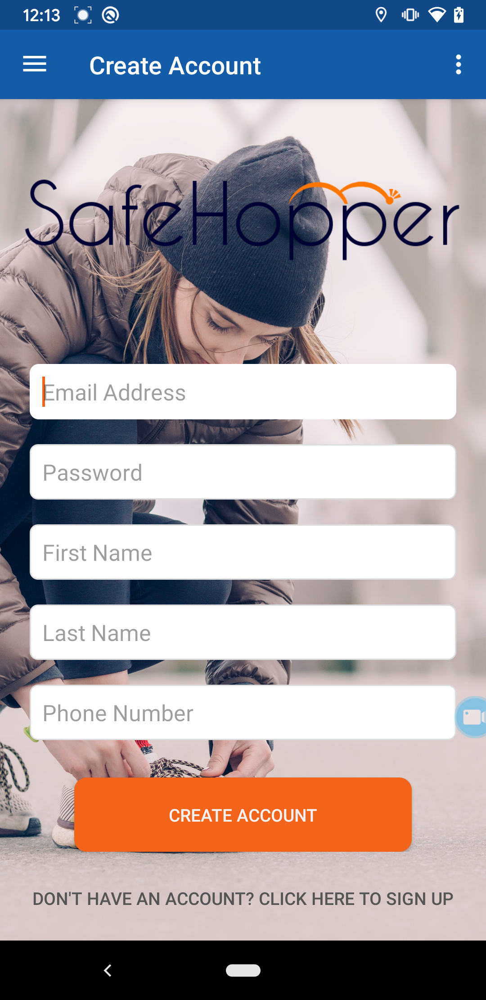</p>
6. After completing the required fields, click on "Create Account". 
   1. You'll be sent an email containing a code to authenticate your account.
7. After this step, you have your SafeHopper Account and you are ready to login and start! 


### 1.2 Logging In
To use the SafeHopper app, you have to first create a SafeHopper account.
1. Open the SafeHopper app 
2. Click on the left top corner of the app to open the menu button.
3. Login to your account using your user name and password that you have created in the previous step.
   <p align="center"></p>
   
4. If you don't have a SafeHopper account, redirect to step 1.1 Creating Account

## Contacts
***
### 2.1 Add Contact
Adding a contact allows the SafeHopper app to send them a text message or email when you are in an emergency situation.
To add a contact :
- tap on the menu button on the top left hand corner. 
- Tap on the “Add Contact” button on the top right hand corner.
- Tap on the “First Name” field and enter in the contacts first name.
- Tap on the “Last Name” field and enter in the contacts last name.
- Tap on the “Email Address” field and enter in the contacts email address.
- Tap on the “Phone Number” field and enter in the contacts phone number.
- Tap on “Text Alerts” to send the contact a text message when there is an emergency situation.
- Tap on “Email Alerts” to send the contact an email when there is an emergency situation.
- If you want to alert the contact with text messages and emails tap on both of the options.
- <p align="center">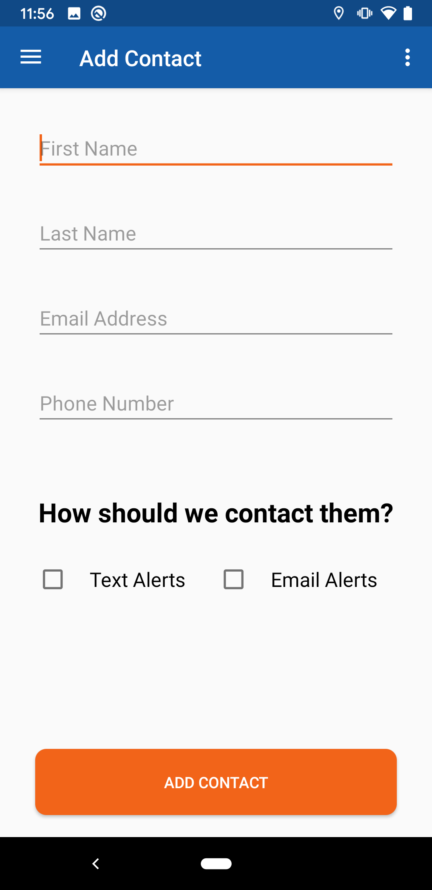</p>
### 2.2 View Contact
It is possible to view your contacts information after you’ve added them to your contacts list. To do so : 
- Tap on the menu button on the left top corner of the home screen. 
- Tap on "Contacts" option 
You can view the contacts information on this page. 
 <p align="center">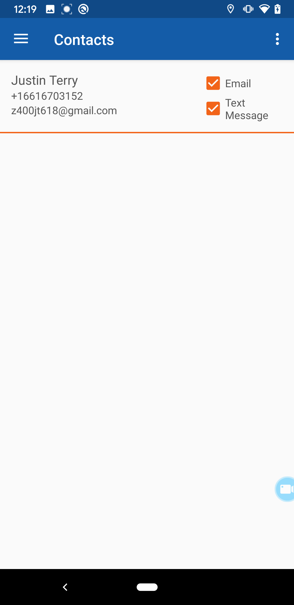</p>


### 2.3 Edit Contact
Editing a contact allows you to change contact information in the SafeHopper application.
First tap on the menu on the top left.
- Tap on the “Contacts” button.
- Tap on any contact you would like to edit.
- Tap on any field you would like to edit, such as “First Name”, “Last Name”, “Email Address”, "Phone Number" or the your preference on how to alert the contact. 
- After making your desired changes, click on "Modify Contact" to save your new changes.
<p align="center">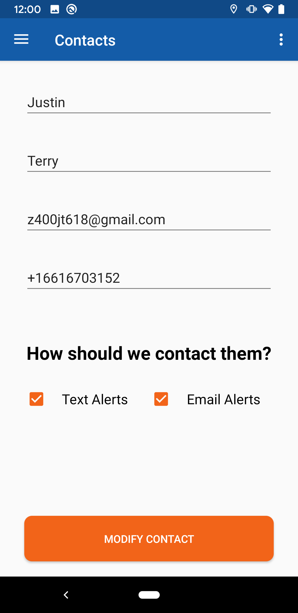</p>

### 2.4 Delete Contact
Deleting a contact will remove them from your contacts list as well as the SafeHoppers Server.
-First tap on the menu on the top left.
- Tap on the “Contacts” button.
- Perform a long press on any contact you would like to delete.
- You will be asked the question that whether or not you are sure to delete the contact. Choose "Yes" to delete and "No" to abort this option.

##  Routes
***
### 3.1 Create Route
Creating a route allows you to make a path you would like to be tracked on.
- First tap on the menu on the top left.
- Tap on the “Create Routes” button.
- On the top right corner, you can activate the Satellite view option.
- Tap on the map to add a starting point.
  - Your starting point will be indicated by an icon.
-  Each successive point will be connected to the previous point with a line. This shows the route you will be tracked on.
   -  To Undo the last line created, click on "Undo Waypoint" and redraw the new line. 
- When you are done creating your route press the “Save And Finish” button on the bottom right hand corner.
- A text box will appear.
- Tap on the “Route Name” field to set the name of your route.
  <p align="center">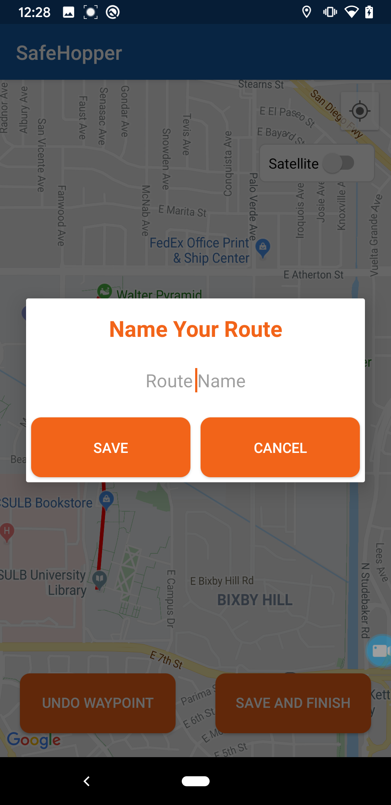</p>

- Tap on the “Save” button to finish creating a new route, or cancel to abort this step.

  <p align="center">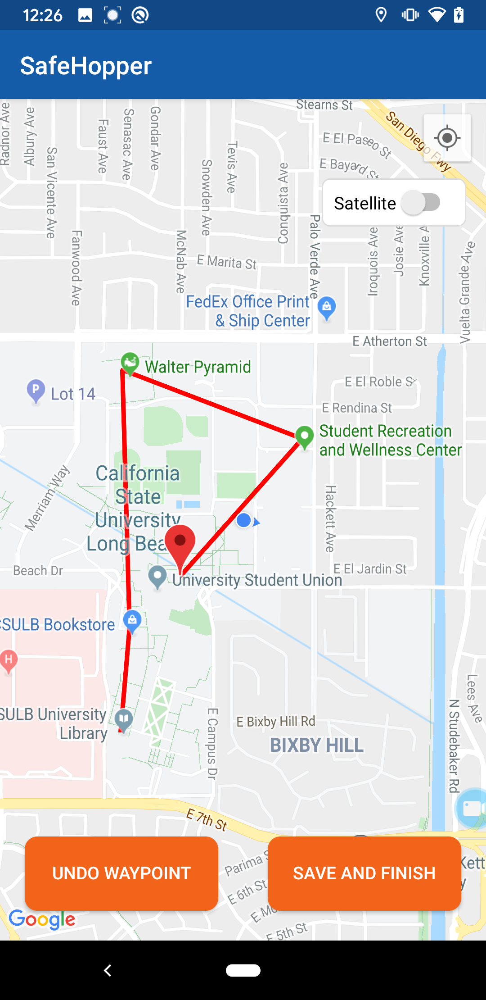
  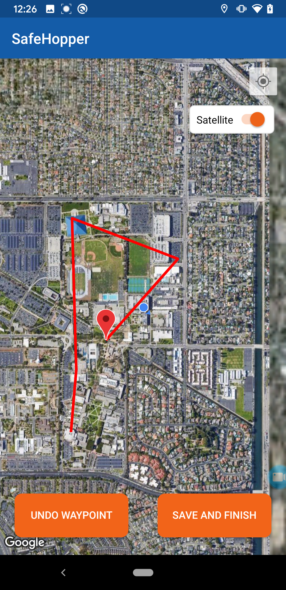 
</p>

### 3.2 View Route
In order to View the route you’ve created on the previous step:
- Login into your account.
- Choose the menu from the homepage.
- tap on "Routes". 
- You can view a list of the routes that you have previously saved. 
- By clicking on each of them, you can open and view the previously saved routes. 
    <p align="center">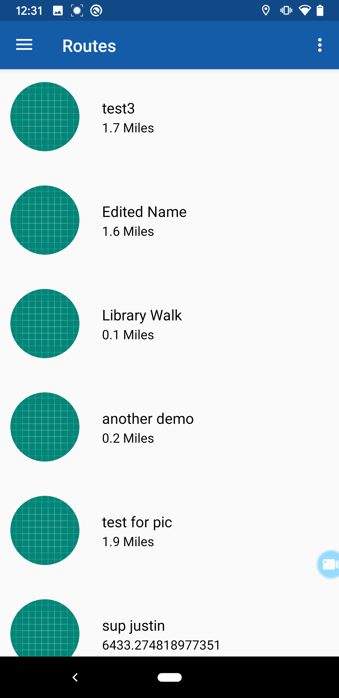</p>


### 3.3 Delete Route Or Modify The Name Of The Route
Deleting a route removes the route from your SafeHopper account.
- Tap on the menu button on the top left of the page.
- Tap on the “Routes” button.
- Long press on the route you want to delete.
- Tap on the “Delete Route” on the bottom of the page.
- Your route will have been deleted.
- By clicking on the modify route, you can change the name of the route you previously saved. 
  <p align="center"></p>


## Session
***
### 4.1 How to start a Session
Starting a session allows the SafeHopper App to track you with or without a route.
- Open the menu from the left hand corner of the screen.
- Tap on "Sessions" option.
- Tap the “Start Session” button on the bottom left of the screen to start a session without a route.
- <p align="center">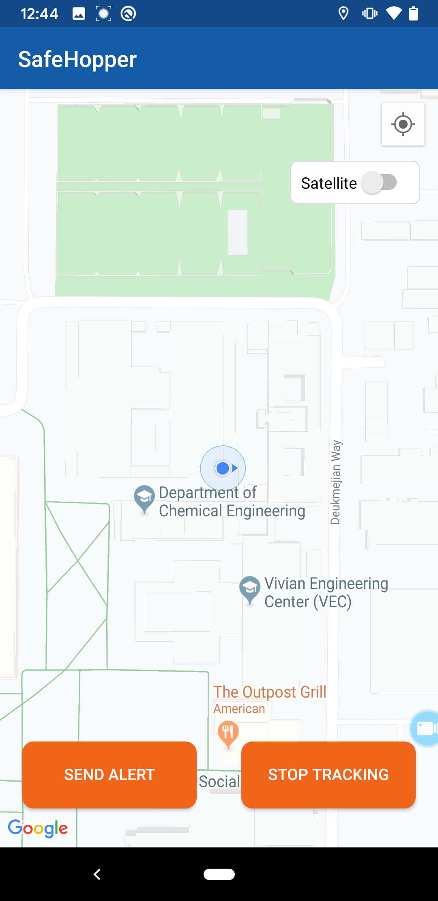</p>
  - After the session has started, you can choose to "Send Alert" or to "Stop Tracking".
  - <p align="center">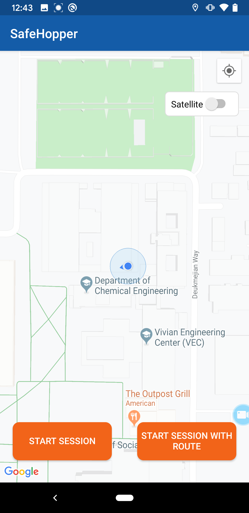</p>
- Tap the “Start Session With Route” button on the bottom of the screen to start a session with a route.
  - You will be brought to the routes screen to select your desired route.

### 4.2 Start Session (Without Route)
Starting a session without a route allows you to freely move around without checking if you are on a specific route. 
A session without a route will be started.
### 4.3 Start Session With Route
Starting a session with a route allows you to be tracked while staying on a route. If you go to far off your route an alert will be sent to your emergency contacts.


## Settings
***
### 5.1 Route Buffer Zone
The route buffer zone allows you to adjust the parameters that set how far you can stray from your routes before alerting your emergency contacts.
- Tap on the menu button on the top left of the page.
- Tap on the “Settings” button.
- Tap on “Route Buffer Zone” to display the options for level of security. 
- The options are low security, medium security, and high security.  Low security has the most leeway for allowing you to stray from your route. High security has the least leeway for allowing you to stray from your route.
- Tap on the level of security you would like on your routes.
- <p align="center">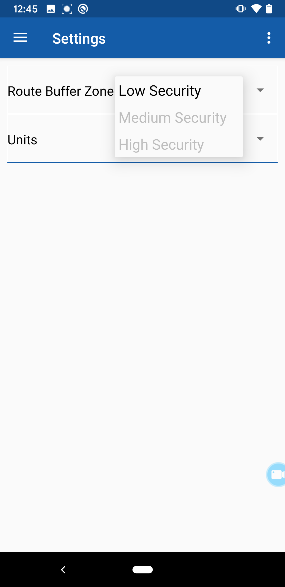</p> 

### 5.2 Units

You can adjust whether you want the units for distance to be displayed using the Metric System or Imperial System.
- Tap on the menu button on the top right of the page.
- Tap on the “Settings” button.
- Tap on “Units” to display the options for the unit system. The options are “Miles/Feet” and “Kilometers/Meters.”
- Tap on the unit system you would like displayed on your routes. 
 <p align="center">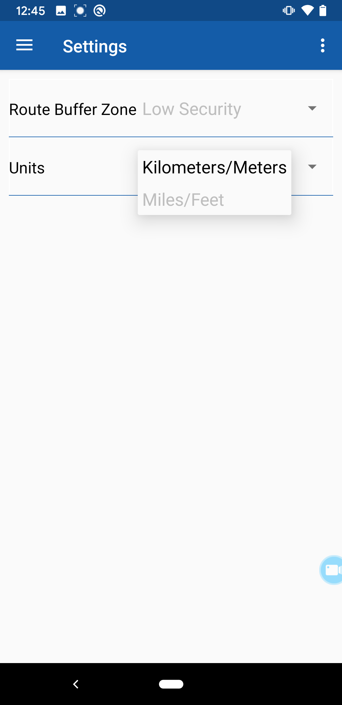</p>

## Built with
***
- Android Studio 3.5 Java
- AWS Congnito for storing users
- Database for tracking real time location
- Android SDK version - Android 8.0 (Oreo)
- Material design for UI components
  
## API  
***
### API Dependencies
- Google Cloud Consoles
### API Response Codes


| Code        | Type           | Description  |
| ------------- |:-------------:| -----:|
| 400      | Bad Request | Indicates that the requested api is not available. |
| 401      | Unauthorized      |   Indicates that the provided API key is invalid |
| 200 | OK      |   Indicates a successful response from server. |


## Development and Contributions
***
Pull requests are welcome. For major changes, please open an issue first to discuss what you would like to change.

